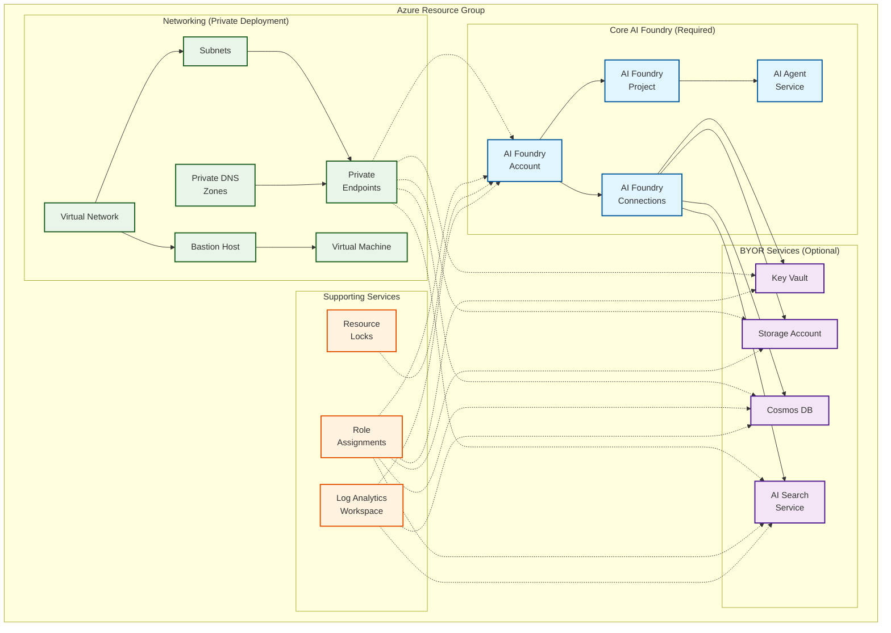

# Azure AI Foundry Pattern Module

This Azure Verified Module (AVM) deploys Azure AI Foundry along with essential and optional supporting services to enable scalable AI application development. It provisions core resources such as the AI Foundry account, projects, agent service, RBACs, and resource locks, which are always deployed for baseline functionality. The module also supports supplemental infrastructure, like networking, compute, and monitoring, through dependent resources, and offers flexibility to either deploy or integrate existing services (BYOR) such as Key Vault, Storage Account, Cosmos DB, and AI Search. These BYOR resources can be provided externally or deployed via the module itself. Example deployment configurations range from minimal public setups to enterprise-grade private environments with VNet isolation and Bastion access, ensuring adaptability across different workload and security requirements.

## Architecture

The following diagram illustrates the key Azure services and components deployed by this pattern module:

**Legend:**
- 🔷 **Blue (Required)**: Core resources always deployed by this module
- 🔶 **Purple (BYOR)**: Optional services that can be deployed by the module or brought from existing infrastructure  
- 🔷 **Green (Dependent)**: Infrastructure components typically deployed in example configurations
- 🔶 **Orange (Support)**: Management and monitoring resources

## Resource Classification

- **Required**: Core resources that are always deployed by this module to ensure baseline functionality of Azure AI Foundry. These include the AI Foundry account, projects, agent service, RBACs, and resource locks.

- **Dependent**: Infrastructure components that support the AI Foundry environment, typically deployed in example configurations. These include networking (e.g., virtual networks, subnets, private DNS zones), compute (e.g., virtual machines, Bastion), and monitoring (e.g., Log Analytics Workspace). These resources are not part of the core module but are necessary for full functionality in specific deployment scenarios. This module is designed to work seamlessly with the [AI Landing Zone Accelerator](https://github.com/Azure/terraform-azurerm-avm-ptn-aiml-landing-zone), which provides broader platform capabilities and complements the dependent infrastructure setup.

- **BYOR (Bring Your Own Resource)**: Optional services that can either be provisioned by this module or integrated as existing resources. These include Key Vault, Storage Account, Cosmos DB, and AI Search. Users can choose to deploy these via the module or reference pre-existing infrastructure to align with organizational standards or reuse existing assets.

## Resource Types

This module deploys resources in three categories:

| Type      | Resource                         | Code Location     | Code / Deployment Notes             |
| --------- | -------------------------------- | ----------------- | ----------------------------------- |
| Required  | AI Foundry                       | Root module       | Always deployed                     |
| Required  | AI Foundry Project               | Root module       | Always deployed                     |
| Required  | RBACs                            | Root module       | BYOR dependency                     |
| Optional  | AI Foundry Connections           | Root module       | BYOR dependency                     |
| Optional  | AI Foundry Project Connections   | Root module       | BYOR dependency                     |
| Optional  | AI Foundry Agent Service         | Root module       | Public deployment only              |
| Optional  | AI Foundry Project Agent Service | Root module       | Private deployment only             |
| Dependent | Virtual Network                  | Example main.tf   | Private deployment only             |
| Dependent | Subnets                          | Example main.tf   | Private deployment only             |
| Dependent | Private DNS Zones                | Example main.tf   | Private deployment only             |
| Dependent | Private DNS Zone vNet Links      | Example main.tf   | Private deployment only             |
| Dependent | Bastion                          | Example main.tf   | Private deployment only             |
| Dependent | Virtual Machine                  | Example main.tf   | Private deployment only             |
| Dependent | Log Analytics Workspace          | Example main.tf   | Private or Public deployment        |
| BYOR      | Key Vault                        | main.byor.tf      | Deployed via module (AVM) or BYOR   |
| BYOR      | Search Service                   | main.ai_search.tf | Deployed via module (azapi) or BYOR |
| BYOR      | Storage Account                  | main.byor.tf      | Deployed via module (AVM) or BYOR   |
| BYOR      | CosmosDB                         | main.byor.tf      | Deployed via module (AVM) or BYOR   |

## Example Deployments

| Example                   | Description                                | Key Features                                      |
| ------------------------- | ------------------------------------------ | ------------------------------------------------- |
| **basic**                 | Minimal AI Foundry deployment              | AI Foundry + Project only, public access          |
| **standard-public**       | Full-featured public deployment            | All services, public endpoints, complete setup    |
| **standard-public-byor**  | Public deployment with existing resources  | Uses existing Storage/KeyVault/Cosmos/Search      |
| **standard-private**      | Enterprise-grade private deployment        | Private endpoints, VNet isolation, Bastion access |
| **standard-private-byor** | Private deployment with existing resources | Private + existing resources combination          |
