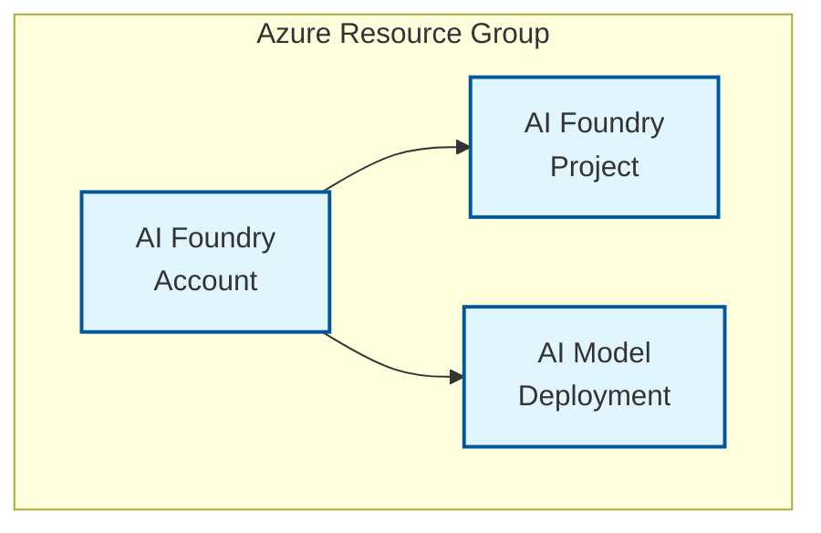

<!-- BEGIN_TF_DOCS -->
<!-- Code generated by terraform-docs. DO NOT EDIT. -->
# Basic example

This deploys the module in its most basic form.

## Architecture

This example deploys only the core AI Foundry components:



**Components:**
- AI Foundry Account with GPT-4 model deployment
- AI Foundry Project for development workspace  
- Public access (no private endpoints or BYOR services)

```hcl
terraform {
  required_version = ">= 1.9, < 2.0"

  required_providers {
    azapi = {
      source  = "Azure/azapi"
      version = "~> 2.0"
    }
    azurerm = {
      source  = "hashicorp/azurerm"
      version = "~> 4.0"
    }
    random = {
      source  = "hashicorp/random"
      version = "~> 3.5"
    }
    time = {
      source  = "hashicorp/time"
      version = "~> 0.12"
    }
  }
}

provider "azurerm" {
  features {
    resource_group {
      prevent_deletion_if_contains_resources = false
    }
    cognitive_account {
      purge_soft_delete_on_destroy = true
    }
  }
}

data "azurerm_client_config" "current" {}

locals {
  base_name = "bascmk"
}

module "regions" {
  source  = "Azure/avm-utl-regions/azurerm"
  version = "0.5.2"

  availability_zones_filter = true
  geography_filter          = "Australia"
}

resource "random_shuffle" "locations" {
  input        = module.regions.valid_region_names
  result_count = 3
}

module "naming" {
  source  = "Azure/naming/azurerm"
  version = "0.4.2"

  suffix        = [local.base_name]
  unique-length = 5
}

resource "azurerm_resource_group" "this" {
  location = random_shuffle.locations.result[0]
  name     = module.naming.resource_group.name_unique
}

resource "azurerm_user_assigned_identity" "this" {
  location            = azurerm_resource_group.this.location
  name                = module.naming.user_assigned_identity.name_unique
  resource_group_name = azurerm_resource_group.this.name
}

module "key_vault" {
  source  = "Azure/avm-res-keyvault-vault/azurerm"
  version = "0.10.0"

  location                        = azurerm_resource_group.this.location
  name                            = module.naming.key_vault.name_unique
  resource_group_name             = azurerm_resource_group.this.name
  tenant_id                       = data.azurerm_client_config.current.tenant_id
  enabled_for_deployment          = true
  enabled_for_disk_encryption     = true
  enabled_for_template_deployment = true
  keys = {
    cmk = {
      key_opts = [
        "decrypt",
        "encrypt",
        "sign",
        "unwrapKey",
        "verify",
        "wrapKey"
      ]
      key_type = "RSA"
      name     = "cmk"
      key_size = 2048
    }
  }
  network_acls = {
    default_action = "Allow"
    bypass         = "AzureServices"
    # ip_rules = ["${data.http.ip.response_body}/32"]
  }
  role_assignments = {
    deployment_user_kv_admin = {
      role_definition_id_or_name = "Key Vault Administrator"
      principal_id               = data.azurerm_client_config.current.object_id
    }
    user_assigned_identity_kv_admin = {
      role_definition_id_or_name = "Key Vault Administrator"
      principal_id               = azurerm_user_assigned_identity.this.principal_id
    }
  }
  wait_for_rbac_before_key_operations = {
    create = "60s"
  }
  wait_for_rbac_before_secret_operations = {
    create = "60s"
  }
}

module "ai_foundry" {
  source = "../../"

  base_name                  = local.base_name
  location                   = azurerm_resource_group.this.location
  resource_group_resource_id = azurerm_resource_group.this.id
  ai_foundry = {
    create_ai_agent_service = false
    name                    = module.naming.cognitive_account.name_unique
    customer_managed_key = {
      key_vault_resource_id = module.key_vault.resource_id
      key_name              = "cmk"
      user_assigned_identity = {
        resource_id = azurerm_user_assigned_identity.this.id
      }
    }
    managed_identities = {
      system_assigned            = true
      user_assigned_resource_ids = toset([azurerm_user_assigned_identity.this.id])
    }
  }
  ai_model_deployments = {
    "gpt-4o" = {
      name = "gpt-4.1"
      model = {
        format  = "OpenAI"
        name    = "gpt-4.1"
        version = "2025-04-14"
      }
      scale = {
        type     = "GlobalStandard"
        capacity = 1
      }
    }
  }
  ai_projects = {
    project_1 = {
      name                       = "project-1"
      description                = "Project 1 description"
      display_name               = "Project 1 Display Name"
      create_project_connections = false
    }
  }
  create_byor              = false # default: false
  create_byor_cmk          = false # default: false
  create_private_endpoints = false # default: false

  depends_on = [azapi_resource_action.purge_ai_foundry]
}

resource "azapi_resource_action" "purge_ai_foundry" {
  method      = "DELETE"
  resource_id = "/subscriptions/${data.azurerm_client_config.current.subscription_id}/providers/Microsoft.CognitiveServices/locations/${azurerm_resource_group.this.location}/resourceGroups/${azurerm_resource_group.this.name}/deletedAccounts/${module.naming.cognitive_account.name_unique}"
  type        = "Microsoft.Resources/resourceGroups/deletedAccounts@2021-04-30"
  when        = "destroy"

  depends_on = [time_sleep.purge_ai_foundry_cooldown]
}

resource "time_sleep" "purge_ai_foundry_cooldown" {
  destroy_duration = "300s" # 5m

  depends_on = [azurerm_resource_group.this]
}
```

<!-- markdownlint-disable MD033 -->
## Requirements

The following requirements are needed by this module:

- <a name="requirement_terraform"></a> [terraform](#requirement\_terraform) (>= 1.9, < 2.0)

- <a name="requirement_azapi"></a> [azapi](#requirement\_azapi) (~> 2.0)

- <a name="requirement_azurerm"></a> [azurerm](#requirement\_azurerm) (~> 4.0)

- <a name="requirement_random"></a> [random](#requirement\_random) (~> 3.5)

- <a name="requirement_time"></a> [time](#requirement\_time) (~> 0.12)

## Resources

The following resources are used by this module:

- [azapi_resource_action.purge_ai_foundry](https://registry.terraform.io/providers/Azure/azapi/latest/docs/resources/resource_action) (resource)
- [azurerm_resource_group.this](https://registry.terraform.io/providers/hashicorp/azurerm/latest/docs/resources/resource_group) (resource)
- [azurerm_user_assigned_identity.this](https://registry.terraform.io/providers/hashicorp/azurerm/latest/docs/resources/user_assigned_identity) (resource)
- [random_shuffle.locations](https://registry.terraform.io/providers/hashicorp/random/latest/docs/resources/shuffle) (resource)
- [time_sleep.purge_ai_foundry_cooldown](https://registry.terraform.io/providers/hashicorp/time/latest/docs/resources/sleep) (resource)
- [azurerm_client_config.current](https://registry.terraform.io/providers/hashicorp/azurerm/latest/docs/data-sources/client_config) (data source)

<!-- markdownlint-disable MD013 -->
## Required Inputs

No required inputs.

## Optional Inputs

No optional inputs.

## Outputs

No outputs.

## Modules

The following Modules are called:

### <a name="module_ai_foundry"></a> [ai\_foundry](#module\_ai\_foundry)

Source: ../../

Version:

### <a name="module_key_vault"></a> [key\_vault](#module\_key\_vault)

Source: Azure/avm-res-keyvault-vault/azurerm

Version: 0.10.0

### <a name="module_naming"></a> [naming](#module\_naming)

Source: Azure/naming/azurerm

Version: 0.4.2

### <a name="module_regions"></a> [regions](#module\_regions)

Source: Azure/avm-utl-regions/azurerm

Version: 0.5.2

<!-- markdownlint-disable-next-line MD041 -->
## Data Collection

The software may collect information about you and your use of the software and send it to Microsoft. Microsoft may use this information to provide services and improve our products and services. You may turn off the telemetry as described in the repository. There are also some features in the software that may enable you and Microsoft to collect data from users of your applications. If you use these features, you must comply with applicable law, including providing appropriate notices to users of your applications together with a copy of Microsoft’s privacy statement. Our privacy statement is located at <https://go.microsoft.com/fwlink/?LinkID=824704>. You can learn more about data collection and use in the help documentation and our privacy statement. Your use of the software operates as your consent to these practices.
<!-- END_TF_DOCS -->