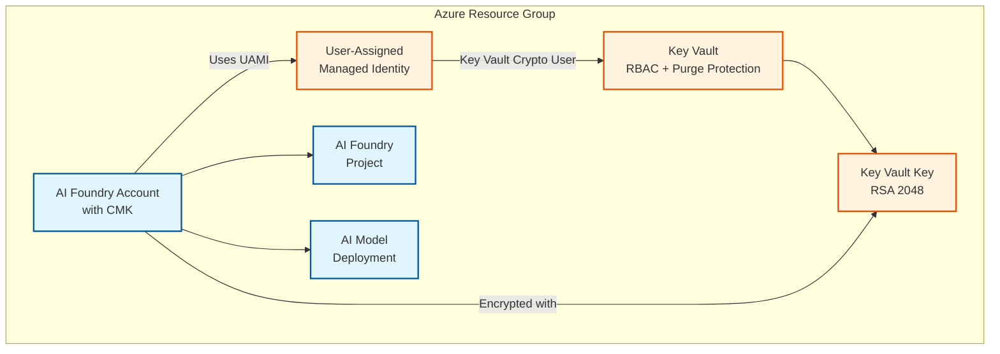

# Basic CMK (Customer-Managed Key) Encryption Example

This example demonstrates how to deploy an AI Foundry account with customer-managed key (CMK) encryption using a user-assigned managed identity (UAMI).

## Architecture

This example deploys AI Foundry with CMK encryption:

**Components:**
- User-Assigned Managed Identity (UAMI) for Key Vault access
- Key Vault with RBAC authorization and purge protection
- RSA 2048-bit encryption key
- AI Foundry Account with CMK encryption
- AI Foundry Project for development workspace
- GPT-4 model deployment

## Deployment Flow

The deployment follows a specific order to ensure CMK encryption works correctly:

1. Create Key Vault, Key, and User-Assigned Managed Identity
2. Deploy AI Foundry account (initially without CMK)
3. Assign "Key Vault Crypto User" role to the UAMI
4. Update AI Foundry account to apply CMK encryption

This two-step approach is necessary because the AI Foundry account must exist before CMK encryption can be configured.
