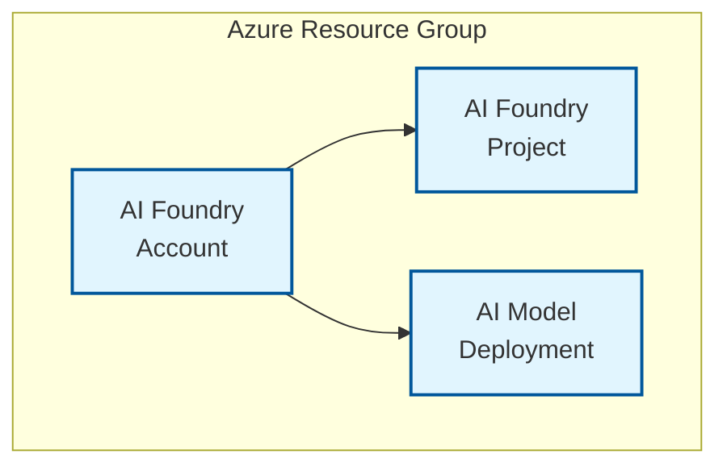

# Basic example

This deploys the module in its most basic form.

## Architecture

This example deploys only the core AI Foundry components:

**Components:**
- AI Foundry Account with GPT-4 model deployment
- AI Foundry Project for development workspace  
- Public access (no private endpoints or BYOR services)
