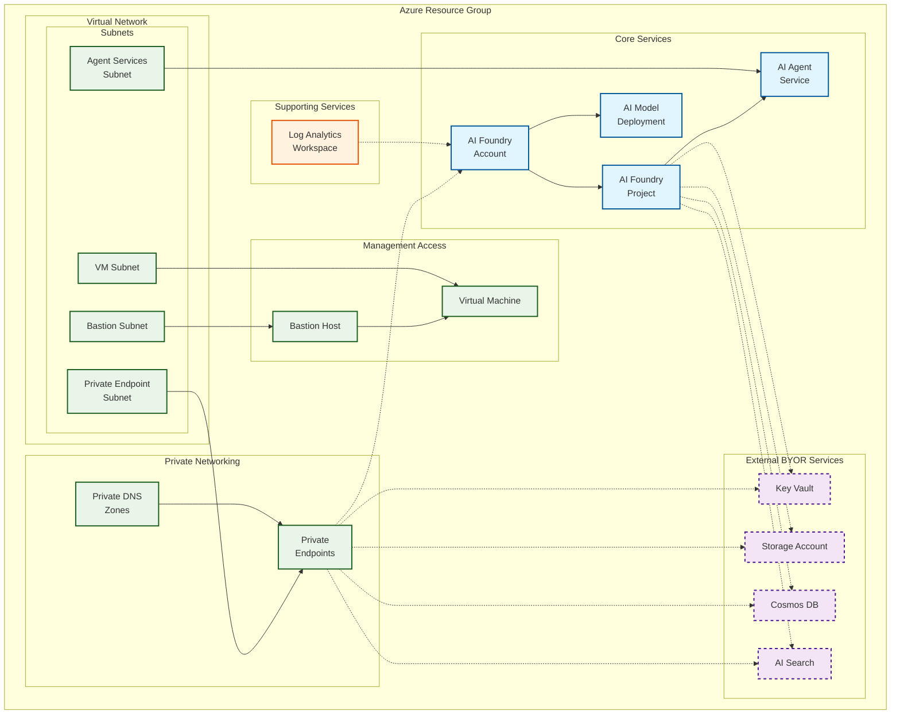

# Private example

This example deploys a simple version of the module with private endpoints enabled.

## Architecture

This example uses externally created BYOR services with AI Foundry using private networking:

**Components:**
- 🔷 **Core AI Foundry** with private access and Agent Services
- 🔶 **External BYOR Services** (Key Vault, Storage, Cosmos DB, AI Search) - dashed borders indicate external resources
- 🔷 **Private Networking** with VNet isolation, dedicated subnets, and private endpoints
- 🔷 **Management Access** via Bastion Host and VM for secure administration
- 🔸 **Supporting Services** (Log Analytics Workspace)

This configuration demonstrates the most comprehensive deployment pattern using external BYOR services with full private networking and secure management access.
