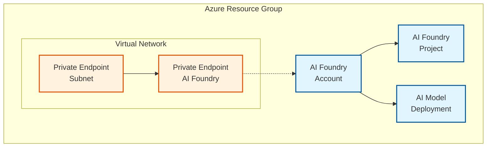

# Private example

This deploys the module with private networking and secure access.

## Architecture

This example demonstrates a deployment with private endpoints for secure connectivity:

**Components:**
- AI Foundry Account with GPT-4 model deployment
- AI Foundry Project for development workspace  
- Private endpoints for secure network access
- No BYOR services (uses managed AI Foundry services)
