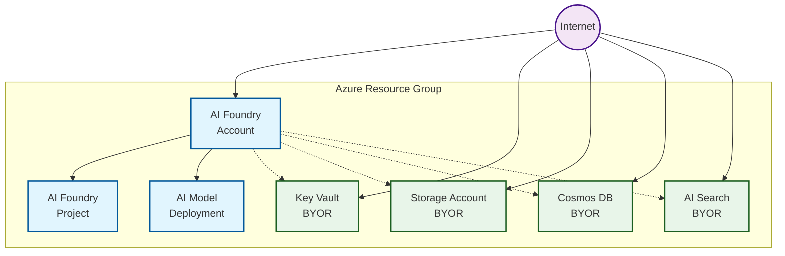

# Public with BYOR example

This deploys the module with public network access and Bring Your Own Resources (BYOR) services.

## Architecture

This example demonstrates a public deployment with custom Key Vault, Storage, Cosmos DB, and AI Search:

**Components:**
- AI Foundry Account with GPT-4 model deployment
- AI Foundry Project for development workspace
- Public network access enabled
- BYOR: Key Vault, Storage Account, Cosmos DB, AI Search
