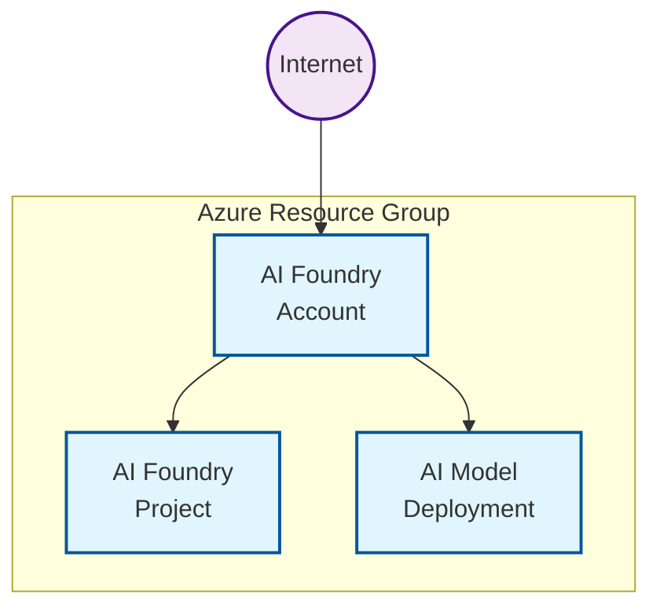

# Public example

This deploys the module with public network access.

## Architecture

This example demonstrates a deployment with public endpoints for development/testing:

**Components:**
- AI Foundry Account with GPT-4 model deployment
- AI Foundry Project for development workspace
- Public network access enabled (no private endpoints)
- No BYOR services (uses managed AI Foundry services)
