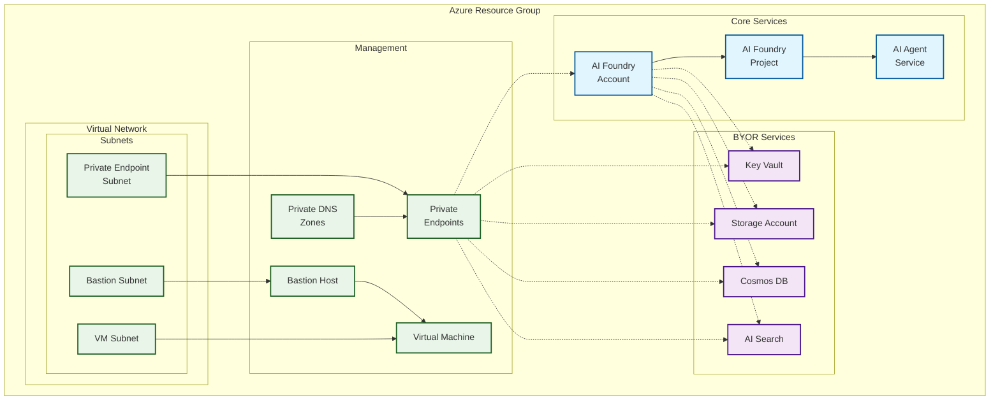

# Private example

This example deploys a simple version of the module with private endpoints enabled.

## Architecture

This example deploys AI Foundry with private networking and supporting services:

**Components:**
- 🔷 **Core AI Foundry** with private access
- 🔶 **Supporting services** (Key Vault, Storage, Cosmos DB, AI Search)  
- 🔷 **Private networking** with VNet isolation and Bastion access
- All services connected via private endpoints for secure communication
