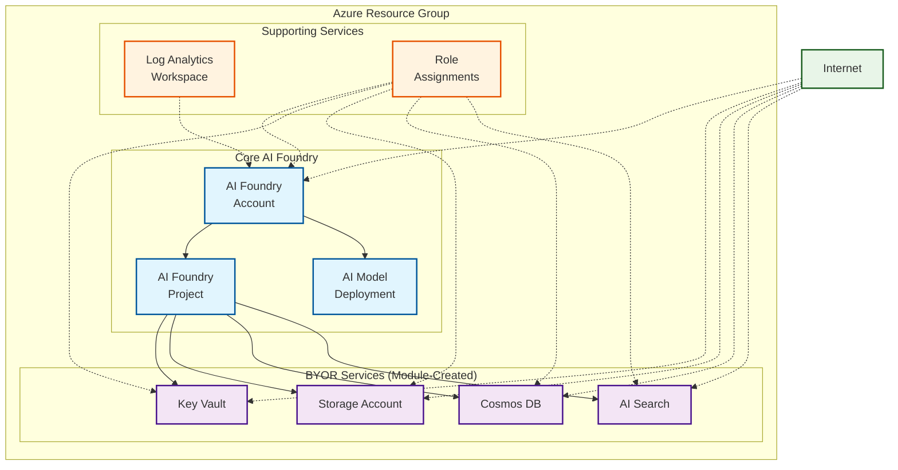

# Public example

This deploys a simple version of the module without private endpoints.

## Architecture

This example deploys AI Foundry with all BYOR services using public access:

**Components:**
- 🔷 **Core AI Foundry** (Account, Project, Model Deployment)
- 🔶 **BYOR Services** created by the module (Key Vault, Storage, Cosmos DB, AI Search)
- 🔸 **Supporting Services** (Log Analytics, Role Assignments)
- 🔷 **Public Access** - All services accessible from the internet

This configuration provides a complete AI Foundry setup with supporting services while maintaining public accessibility for simplified access patterns.
